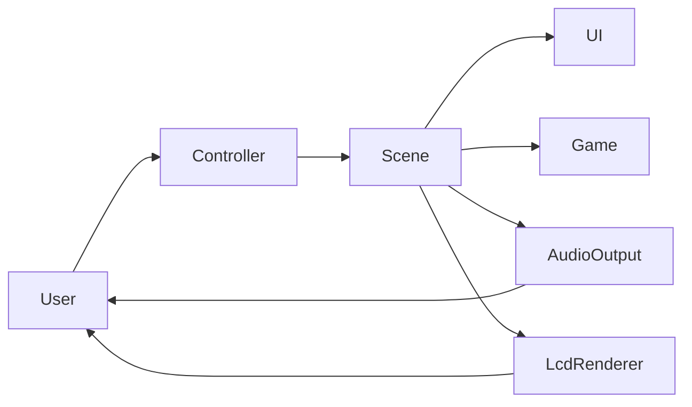
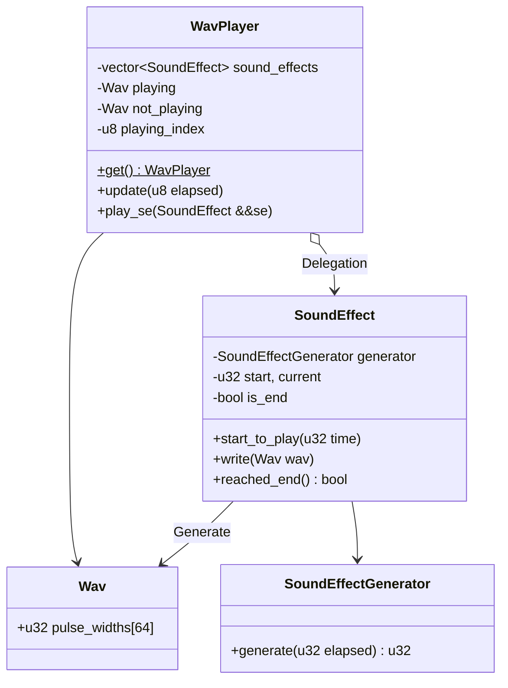
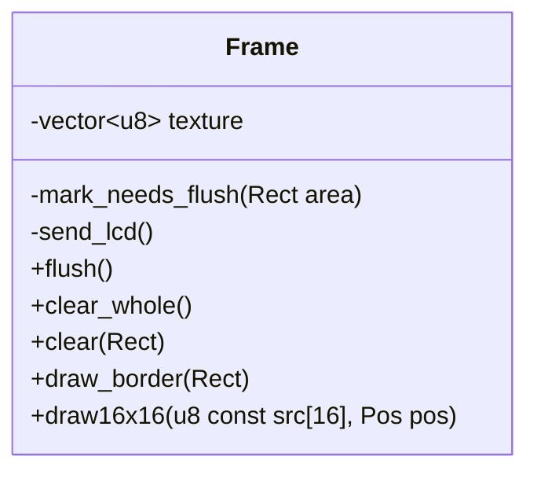
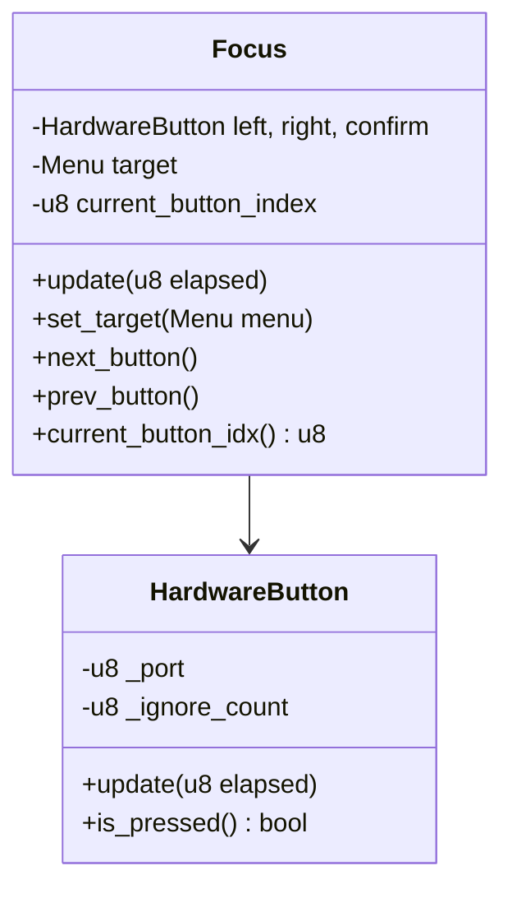
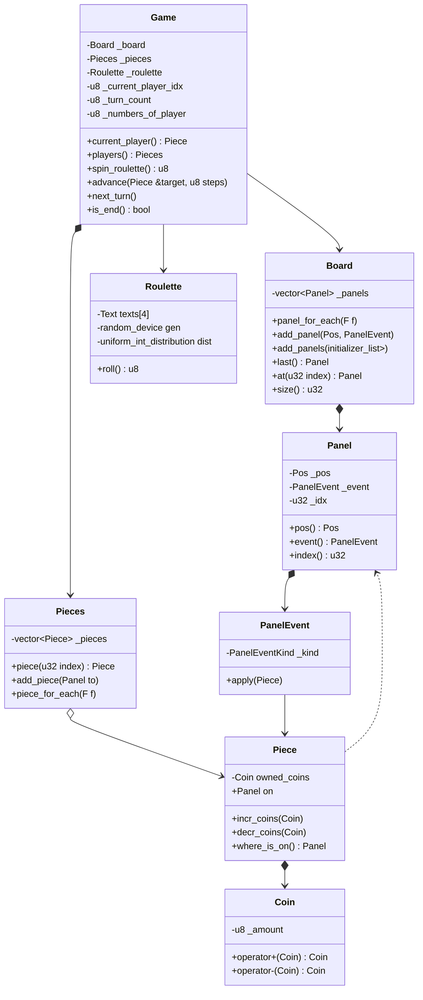
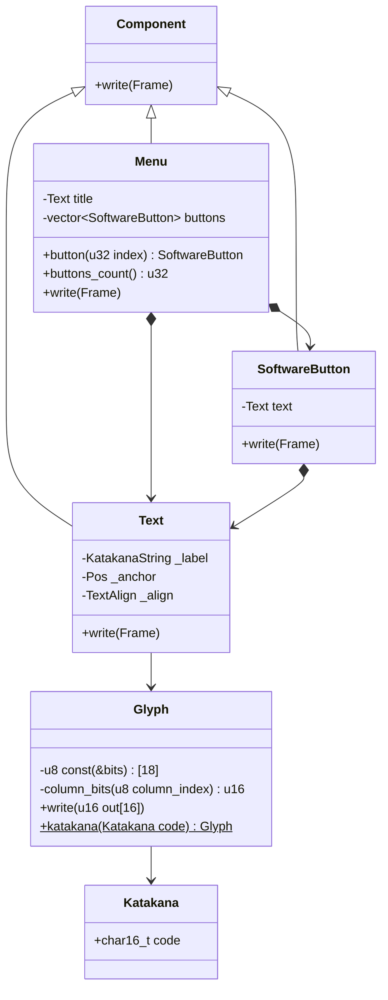
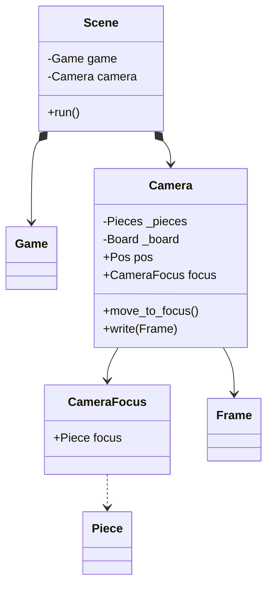

<h1 style="width: 100%; text-align: center;">
  制御プログラム説明書
</h1>

<small style="float: right">
  MikuroXina
</small>

  注意: 本説明書で整数型を表すときは, ビット長を明確にするために <code>int</code> や <code>unsined long</code> ではなく <code>i16</code> や <code>u32</code> といった表記を行う.

# モジュール構成

この制御プログラムは, `Controller`, `Scene`, `UI`, `Game`, `AudioOutput`, `LcdRenderer` の 6 つのモジュールに分かれている. それぞれ, ボタン入力の制御, 抽象的なフローの管理, 画面上のユーザーインターフェイス, ゲームのルールに関するロジック, 音声出力, LCD への描画を担う.

ユーザは `Controller` へ入力を行い, `AudioOutput` 及び `LcdRenderer` から出力を受け取ることを想定している. モジュール間とユーザのデータの流れを下図に示す.

## 制御システム

`AudioOutput`, `LcdRenderer`, `Controller` の 3 つのモジュールは制御システムである. これは, ハードウェアとのやり取りを実際に行う.

### 音声出力

`WavPlayer` は再生中と非再生中の `Wav` を入れ替えながら再生する. 再生中の `Wav` を再生し終わったら非再生中のものと入れ替えて, 時間の余裕があるときに非再生中の `Wav` を再生成する.

`SoundEffect` は再生時間を管理し, `SoundEffectGenerator` へ経過時間を渡して `Wav` を生成する.

`SoundEffectGenerator` を複数用意することで, 様々な効果音を一つのクラスで表現する.

### LCD 描画

`Frame` は 128 x 64 のテクスチャを管理し, それへの描画手段を提供する. また, テクスチャの行ごとに変更が加わったかどうかを管理し, `flush` で LCD へ出力するときの処理を削減する.

`clear_whole` で画面全体を, `clear` で指定の領域を消去できる.

`draw_border` で長方形を, `draw16x16` で任意のビットマップを書き込める.

`flush` を呼び出すことでテクスチャが LCD へ反映される.

### コントローラー

この装置に付いている 3 つのボタンそれぞれを, 対応した `HardwareButton` オブジェクトが管理する. ボタンの入力状態を監視し, 入力後一定時間が経過するまでボタン操作を無視することでチャタリングを防止する.

`Focus` では 3 つのボタン入力を掌握して, `Menu` 上のカーソルの移動とその `SoftwareButton` のイベント実行を行う.

## ゲームシステム 

`Game`, `UI`, `Scene` の 3 つのモジュールはゲームシステムである. これは, 抽象的なゲームモデルの表現と管理を行う.

### ゲームルール

`Game` では `Board`, `Pieces`, `Roulette` を集約して, このゲームのルールをそれぞれに委譲しながら処理する.

`Board` はすごろくの盤面を表現する. このために複数の `Panel` を管理する. `Panel` は盤面上のマス目を表現するもので, 位置やイベントなどを保持する. `PanelEvent` は `Piece` を書き換えて

`Pieces` はゲーム中の `Piece` すべてを管理する. `Piece` は盤面上のコマを表現し, 所持 `Coin` と踏んでいる `Panel` を保持する.

`Coin` は各コマのプレイヤーが持っているコインの枚数である. 必ず 0 以上になり, それより小さく引くことはできない.

`Roulette` は 1 から 4 のテキストのメニューを用意する. ランダムに速度を落としながら自動でフォーカスを切り替え, 止まったときの数を出力する.

### UI 管理

`Component` は `Frame` を利用した描画を行う抽象である. 実際には静的ディスパッチで表現しているため, このクラスは実在しない.

`Text` ではカタカナ文字列 `KatakanaString` の描画を行う. アンカー位置を基準に `TextAlign` の寄せる方向に合わせ, カタカナ文字列の各文字を `Glyph` に変換して描画する.

`Glyph` は五十音のカタカナを 12 x 12 で表現したビットマップデータである. 余白を入れて 16 x 16 の一文字として描画する.

`SoftwareButton` は `KatakanaString` から生成した `Text` を保持する. 描画の際は枠を描画しつつテキスト部分の描画を `Text` へ委譲する.

`Menu` はタイトルと選択肢の `KatakanaString` からタイトルの `Text` と選択肢の `SoftwareButton` を複数生成し保持する.

### シーン

`Scene` はプレイ人数と盤面データ `Board` から `Game` を生成する. また, `Camera` を生成して `Board` の情報を渡し, 盤面を描画できるようにする.

`Camera` は `CameraFocus` で特定の `Piece` に注目する. `CameraFocus` から取得したコマの座標へ移動できる. カメラに映るモノを描画する際は, 注目しているコマを中心に前後 4 マスの `Panel` を描画する.

